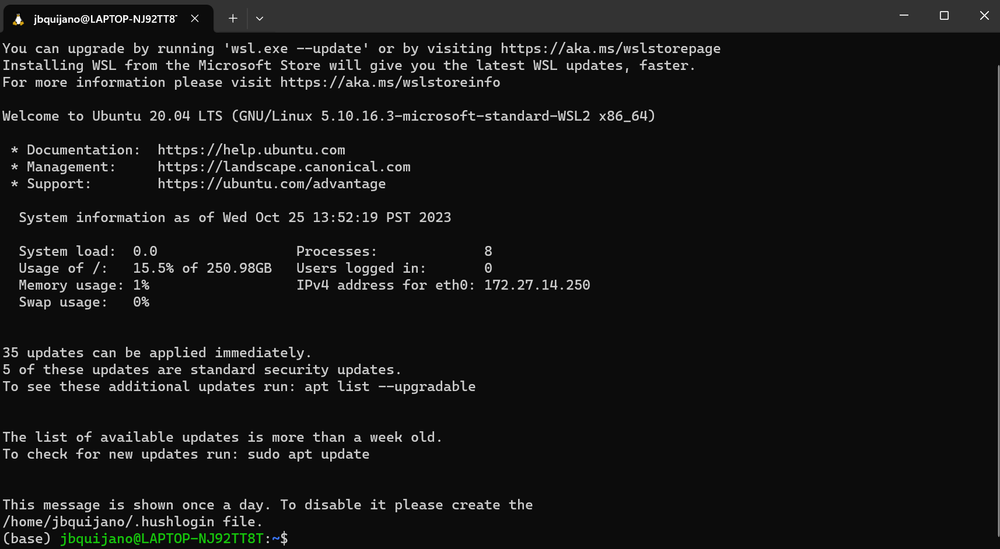

```{r setup, include=FALSE}
knitr::opts_chunk$set(echo = TRUE)
```

# Session 01-01. Installing QIIME2 in Windows
## Install WSL
You cannot natively install QIIME2 in Windows natively.

To install it, you need a Linux environment to run it.

Open **PowerShell** or **Windows Command Prompt** in administratot mode by right-clicking and selecting "Run as administrator."

```{r picture_01, echo=FALSE}

```

**Note:** Ubuntu will be installed as a default.

## Install Miniconda
Run WSL

```{r picture_02, echo=FALSE}

```


In your WSL, run the following codes:

```{r code_01, eval=FALSE}
mkdir -p ~/miniconda3
wget https://repo.anaconda.com/miniconda/Miniconda3-latest-Linux-x86_64.sh -O ~/miniconda3/miniconda.sh
bash ~/miniconda3/miniconda.sh -b -u -p ~/miniconda3
rm -rf ~/miniconda3/miniconda.sh
```

