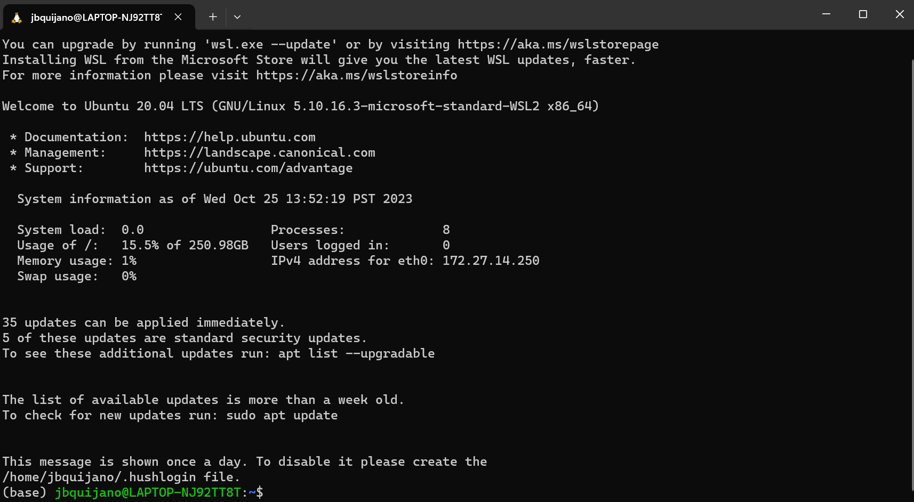
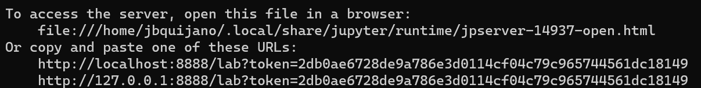

# Session 01-02. Installing QIIME2 in Windows

## Install WSL

You cannot natively install QIIME2 in Windows.

To install it, you need a Linux environment to run it.

Open **PowerShell** or **Windows Command Prompt** in administrator mode
by right-clicking and selecting “Run as administrator.”


**Note:** Ubuntu will be installed as a default.

## Install Miniconda

Run WSL



In your WSL, run the following codes:

``` r
mkdir -p ~/miniconda3
wget https://repo.anaconda.com/miniconda/Miniconda3-latest-Linux-x86_64.sh -O ~/miniconda3/miniconda.sh
bash ~/miniconda3/miniconda.sh -b -u -p ~/miniconda3
rm -rf ~/miniconda3/miniconda.sh
```

After installing, initialize your newly-installed Miniconda. The
following commands initialize for bash and zsh shells:

``` r
~/miniconda3/bin/conda init bash
~/miniconda3/bin/conda init zsh
```

## Install QIIME2

Once Miniconda is installed, install QIIME2.

``` r
wget https://data.qiime2.org/distro/core/qiime2-2023.7-py38-linux-conda.yml
conda env create -n qiime2-2023.7 --file qiime2-2023.7-py38-linux-conda.yml
```

Optional cleanup:

``` r
rm qiime2-2023.7-py38-linux-conda.yml
```

## Activate QIIME2 conda environment

Activate the `conda` environment.

``` r
conda activate qiime2-2023.7
```

Test your installation.

``` r
qiime --help
```

## Install JupyterLab, our IDE of choice

Install jupyterlab through conda

``` r
conda install -c conda-forge jupyterlab
```

Run jupyterlab

``` r
jupyter lab --no-browser
```

## Open JupyterLab

Do all your codes in jupyterlab. Access it by getting the link produced
by your terminal (see example below).


